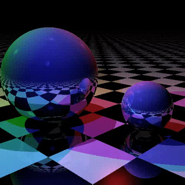

# Assignment 3:  Distribution Ray Tracing 

## Author

**Name: Albert Xing

## Which choice did you make for the second part:

**Choice:  Motion Blur

## Rubric

The assignment will be graded out of 30, and grades distributed as follow:
- Antialiasing. 10
- Additional Feature (Soft Shadows or Motion Blur). 15
- Different scene. 5

### Overview 

The code included in the assignment is a basic ray tracer, largely taken from the Typescript [samples](https://github.com/Microsoft/TypeScriptSamples) on github.com. It has been extended to render the frames incrementally (line by line) so that the frames are displayed as they are rendered, to allow the rendering resolution to be different than the canvas size, and to render multiple frames into a video with the Whammy client-side WebM video encoder (https://github.com/antimatter15/whammy).  The project creates a video like this:



**IMPORTANT**:  the Whammy library relies on being able to create (not just view) "image/webp" images from a canvas. It does not work in all web browsers (e.g., we had problems with Safari and Firefox); while most browsers now display WebM video and WebP images, they do not all support converting image buffers to WebP.  We recommend you use Chrome for this assignment. 

The goal of this assignment is to extend this simple raytracer to support distribution ray tracing, specifically two improvements (antialiasing and one other effect) that make better looking videos.  You should read the appropriate sections in Chapter 13 in your textbook to prepare for the assignment.

## Due: Sunday October 27th, 11:59pm

## Overview 

You will implement two specific uses of distribution ray tracing:

1. *Antialiasing from jittered supersampling*, described in 13.4.1.  You should implement a NxN grid of sample bins, and select a random point to sample from each bin. The N*N colors should be averaged to get the final color for each pixel.
2. One of *Soft Shadows* (section 13.4.2) and *Motion blur* (described in 13.4.5).  Each of these uses random distributions of rays in slightly different ways.

Details are below, but at a high level:

- For Soft Shadows, you should add a "size" to each light, and each time a light ray is needed, sample from across the light.  There are at least two different approaches you can choose to implement (described below).
- For Motion Blur, you should enhance the supersampling implemented for anti-aliasing so that each ray cast into the scene should have a random time in the video frame time interval associated with it, and that time should be used to compute all relevant properties of objects.

All of your videos should be generated at 640x480. 

## Details

The sample code has been extended to support creating a video from a sequence of frames, where the render() method accepts a video *length* (in seconds) and *fps* (frames per second), and uses those to compute the number of frames to be rendered.  When you are testing your code, you should take advantage of the fact you can change the length, number of frames and number of pixels in the video. Low resolution, low frames-per-second videos can help you test parts of your code quickly, before rendering high resolution, high frame-rate movies.

### Antialiasing

The changes necessary for the implementing antialiasing will all be in the ```render()``` method. You should add a ```grid: number``` parameter to ```render()``` For each pixel, you should generate ```grid * grid```  rays using jittered points within each bin, cast them into the scene and use the average of the resulting colors as the color for the pixel.  

### Chose One of Two Additional Features

Choose between Motion Blur and Soft Shadows.  These will build on the antialiasing implementation, using the same ```grid: number``` parameter to determine the number of rays to shoot in the scene per pixel.  

For Motion Blur, we use a different time value for each of the rays, and then do anti-aliasing of the final pixel as above.

For Soft Shadows, we will use a random sampling across the light source.  You may choose to either do one random sample for the light for each ray from the eye (as described in the book) or do a grid of random samples from each point to each light;  the later will use a lower grid number for a similar result, but have a higher computational cost (so it will run slower).  Choose whichever you are more comfortable with. 

#### Motion blur

To implement motion blur, you will need to update the ```intersect()``` method of the ```Thing``` class to include a ```time: number``` parameter (there are other changes you will need to make to the code, many of them to get the time value down to where ```intersect()``` is called, but this is the key change). 

For each ray that you shoot into the scene, you should sample a random time in the time interval corresponding to the current frame.  For example, if you are generating a video that has 10 frames per second, the 1st frame covers the time interval [0, 0.1], the second [0.1, 0.2], and so on, and pass that time value to ```traceRay()```.

You will need to update the ```intersect()``` methods of the subclasses of ```Thing``` to take time into account:  the Plane object can ignore Time for this assignment.  

One approach would be to add a new method to the Sphere to compute the center of the sphere at a given time: 
```js
getCenter(time: number): Vector 
```
The default (non-moving) Sphere could just return the center vector. You could implement a new ```Sphere``` called ```MovingSphere``` that overrides the ```getCenter()``` method to compute the center of a moving sphere. You would call this method to determine the center of the Sphere whenever it is needed by the ```intersect()``` method.  

**IMPORTANT**:  the sample program has code to move the sphere embedded in the ```updateScene()``` method called from the ```render()``` method. However you decide to arrange your code, you should move the relevent bits of this code into the ```computeCenter``` method, and remove it from ```updateScene()```.  

#### Soft Shadows

For soft shadows, you will build on top of the antialiasing implementation, but implement area light sources. There are different ways to do this, as described in the book and the class slides.  We recommend using one of these approaches, but if you have a different approach you want to use, please check with us.

The difference between the two recommended approaches is that the final version in the book picks a set of random points to use for the area lights that is the same size as the number of initial rays generated per pixel, and uses one light sample per ray on all the area lights.  In the version in the notes, each time a surface point P has it's color contribution calculated for a light, a set of rays are generated for the area light source.  (The latter version is much more computationally expensive, but generates a more predictable image for the same size grid of initial rays per pixel.)

Regardless of the approach, you will need to change the Light objects to have a two additional points that specify the size and orientation of the light, ```a: Vector``` and ```b: Vector```, similar to Figure 13.14 in the text. However, instead of the current light position being the ```c: Vector``` in Figure 13.14 (at the lower left of the area light), it should be the center, so the actual light will be twice the size of the illustration in 13.14 (i.e., the light goes from ```[c-a,c-b]``` to ```[c+a, c+b]```).  The 2D randomized pixel generated for each light would be two [0 ... 1] values, which specify where in this rectangle the ray starts (e.g., [0.5, 0.5] is the center, which is the original light position).  

The changes required for the code differ depending on how you choose to implement things.  For the book version, you will need to add a 2D parameter to ```traceRay()``` (and any other methods you need to) for the jittered light position value to be passed down and used by the lighting computations.  For the class notes version, you will need to pass down the grid size into the part of the code that computes the contribution of a light to color of a point (so you can generate the grid of rays there). 

## Submission

Your grade will be based on satisfying the requirements described above.  You should clearly indicate in your submitted version of this README which option you chose for the 2nd part.

**You should add a boolean ```onlyAntialias``` flag to ```render()``` to tell the raytracer to run either with antialiasing (flag true) or with antialiasing and your additional effect**.  This will allow you (or the TAs) to generate either the anti-aliased video, or the additional effect video.  

Also, for the third video, **you should create a new scene**, and leave the ```defaultScene()``` as it is, so the original scene or the new scene can be used.

You will check out the project from github classroom, and submit it there.  The project folder should contain the files that were in the sample project, plus any additions to the sample project that are needed to implement the project.  Do not remove the .gitignore file (we do not want the "node_modules" directory in your repository.)

You will also submit at least three movies.  The movies should be 640x480 resolution, at least 2 seconds long, with a frame rate of 10 fps.  Please name the movies appropriately so the TAs know which is white.  The movies should be:

1. Movie of the same sample scene created by the sample code, with the addition of antialiasing.
2. The same movie as 2., with the addition of either Motion blur or Soft Shadows.
3. Change the scene in some non-trivial ways (e.g., at least change change the light color and positions, and the positions and attributes of the objects in the scene).  You are free to add new kinds of motions, or make other changes that interest you, but that is not required.


Each movie should be an MP4 file, so it is easy for the TAs to view.  You should download the .webm movie (be sure to name it with the .webm suffix) and convert to an .mp4 of the same resolution.  We had success and using the web service at http://video.online-convert.com/convert-to-mp4. (There are also software packages you can download for different platforms.) Please make sure to create an MP4 file of the same size and framerate as your .webm movie.

**Do Not Change the names** of the existing files (e.g., index.html, raytracer.ts, etc).  The TAs need to be able to test your program as follows:

1. cd into the directory and run ```npm install```
2. compile with ```tsc```
3. start a local web server in your directory (see below) and visit ```index.html```

Please test that your submission meets these requirements.  For example, after you check in your final version of the assignment to github, check it out again to a new directory and make sure everything builds and runs correctly.
 
# Development Environment

The sample has already been set up with a complete project for Typescript development, similar to the earlier Assignments.  Please continue to use whatever setup works best for you.  
